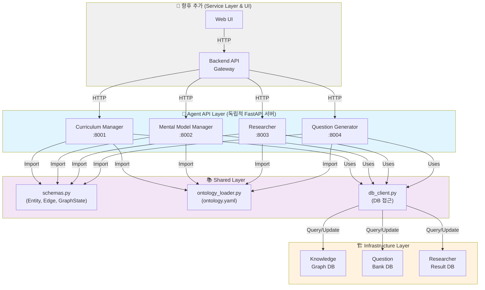
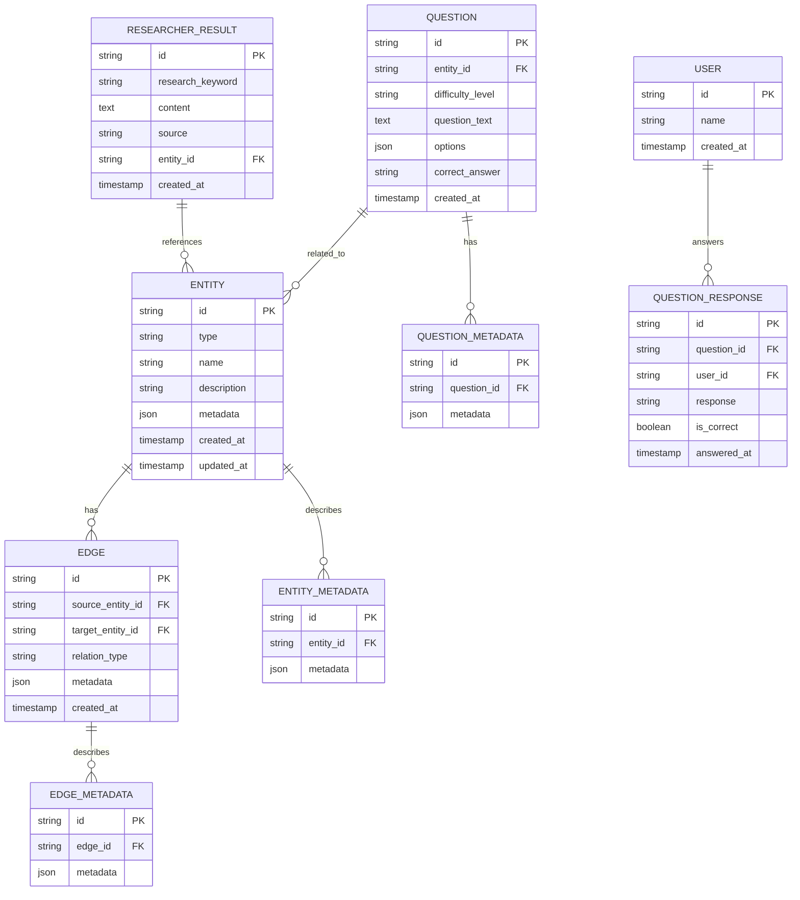
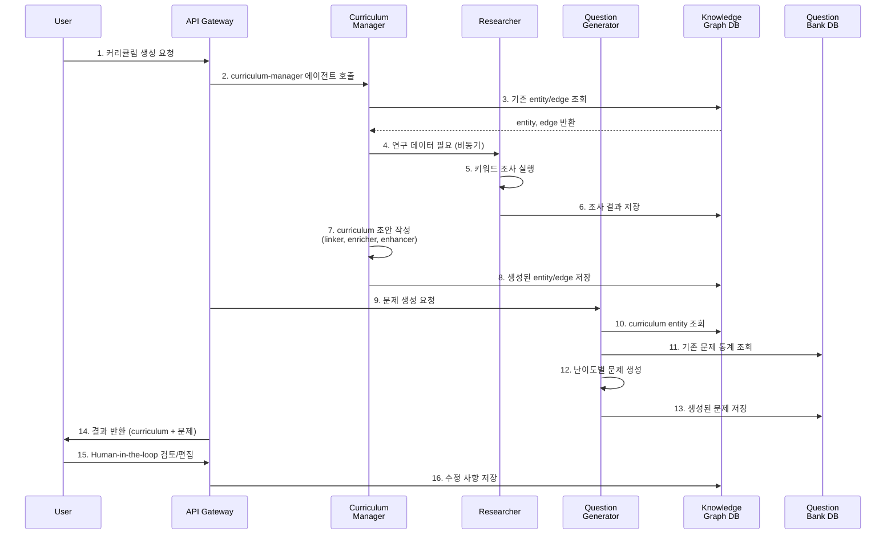

# Monorepo Architecture Refactor - 2026-05-14

## 목표
멀티에이전트 시스템으로 확장 가능한 구조로 리팩토링. 현재 curriculum-manager 코드를 agents 폴더 하위로 이동하고, 공유 자산과 인프라를 분리 관리.

---

## 디렉토리 구조

```
curriculum-manager/
├── infra/                          # 인프라 & DB 관리
│   ├── docker-compose.yml          # 로컬 개발 환경
│   ├── k8s/                        # Kubernetes 매니페스트
│   │   ├── knowledge-graph-db.yaml
│   │   ├── question-bank-db.yaml
│   │   └── ...
│   ├── terraform/                  # IaC (AWS/GCP/Azure)
│   ├── db/
│   │   ├── migrations/
│   │   └── schemas/
│   │       ├── knowledge-graph.sql
│   │       ├── question-bank.sql
│   │       └── researcher-db.sql
│   └── local/
│       ├── setup.sh
│       └── .env.local
│
├── shared/                         # 모든 에이전트가 공유하는 라이브러리
│   ├── __init__.py
│   ├── schemas.py                  # Pydantic 스키마 (Entity, Edge, GraphState)
│   ├── ontology_loader.py          # ontology.yaml 로딩
│   ├── db_client.py                # DB 접근 클래스 (신규)
│   └── ontology.yaml               # 도메인 온톨로지
│
├── agents/                         # 에이전트 로직 (순수 비즈니스 로직)
│   ├── curriculum-manager/         # 첫 번째 에이전트
│   │   ├── src/
│   │   │   ├── __init__.py
│   │   │   ├── harness.py          # 메인 오케스트레이션
│   │   │   ├── state_manager.py    # 상태 관리
│   │   │   └── graphs/
│   │   │       ├── draft_graph.py
│   │   │       ├── link_graph.py
│   │   │       └── expand_graph.py
│   │   ├── skills/                 # 에이전트 스킬 (LLM 프롬프트)
│   │   │   ├── seed_agent_skill.md
│   │   │   ├── concept_agent_skill.md
│   │   │   ├── linking_agent_skill.md
│   │   │   ├── tech_agent_skill.md
│   │   │   ├── synthesizer_skill.md
│   │   │   ├── critic_agent_skill.md
│   │   │   └── devils_advocate_skill.md
│   │   ├── tests/
│   │   ├── cli.py                  # CLI 인터페이스 (기존)
│   │   └── README.md
│   │
│   ├── mental-model-manager/       # 향후 추가 예정
│   │   ├── src/
│   │   ├── skills/
│   │   ├── cli.py
│   │   └── ...
│   │
│   ├── researcher/                 # 향후 추가 예정
│   │   ├── src/
│   │   ├── skills/
│   │   ├── cli.py
│   │   └── ...
│   │
│   └── question-generator/         # 향후 추가 예정
│       ├── src/
│       ├── skills/
│       ├── cli.py
│       └── ...
│
├── apps/                           # FastAPI 서버 (API 서빙 계층)
│   ├── __init__.py
│   ├── curriculum_manager/
│   │   ├── __init__.py
│   │   ├── main.py                 # FastAPI 앱 정의 및 실행
│   │   ├── routes.py               # API 엔드포인트 정의
│   │   └── schemas.py              # 요청/응답 Pydantic 모델
│   │
│   ├── researcher/
│   │   ├── main.py
│   │   ├── routes.py
│   │   └── schemas.py
│   │
│   ├── question_generator/
│   │   ├── main.py
│   │   ├── routes.py
│   │   └── schemas.py
│   │
│   ├── mental_model_manager/
│   │   ├── main.py
│   │   ├── routes.py
│   │   └── schemas.py
│   │
│   └── shared_api/                 # 공유 API 유틸
│       ├── __init__.py
│       └── health.py
│
├── tests/                          # 통합 테스트
│   ├── test_agent_integration.py
│   ├── test_api_integration.py
│   └── test_db_connection.py
│
├── pyproject.toml                  # Root에서 모든 의존성 관리
├── .env.example
├── .gitignore
├── README.md                       # 프로젝트 개요
└── docs/
    ├── review/                     # 아키텍처 리뷰 문서
    │   └── architecture_refactor_20260514.md (이 파일)
    └── draft/
```

---

## 시스템 아키텍처



---

## 데이터베이스 관계도



---

## 각 에이전트 API 스펙

### Curriculum Manager API
**Base URL**: `http://localhost:8001`

```
POST /generate
- 요청: curriculum subject, depth, scope
- 응답: curriculum entities + edges (knowledge graph)

GET /status/{task_id}
- 응답: task 진행 상태 (pending/running/completed)

GET /results/{task_id}
- 응답: 생성된 curriculum 결과

PUT /entities/{entity_id}
- 요청: entity 수정 사항
- 응답: 업데이트된 entity
```

### Mental Model Manager API
**Base URL**: `http://localhost:8002`

```
POST /generate
- 요청: entity id, mental model type
- 응답: mental model 초안

GET /mental-models/{entity_id}
- 응답: entity의 mental model
```

### Researcher API
**Base URL**: `http://localhost:8003`

```
POST /research
- 요청: keywords, sources (blog, linkedin, etc.)
- 응답: task_id

GET /results/{task_id}
- 응답: 조사 결과

GET /research-db/{entity_id}
- 응답: entity 관련 조사 결과
```

### Question Generator API
**Base URL**: `http://localhost:8004`

```
POST /generate
- 요청: entity_id, difficulty_level, count
- 응답: 생성된 문제들

GET /questions/{entity_id}
- 응답: entity 관련 기존 문제

POST /validate
- 요청: question_id, user_answer
- 응답: 채점 결과
```

---

## Agent vs App 계층 분리

### agents/ (비즈니스 로직만)
```
agents/curriculum-manager/
├── src/
│   ├── __init__.py
│   ├── harness.py              # 핵심 오케스트레이션 로직
│   ├── state_manager.py        # 상태 관리
│   └── graphs/
│       ├── draft_graph.py
│       ├── link_graph.py
│       └── expand_graph.py
├── skills/
│   ├── seed_agent_skill.md
│   ├── concept_agent_skill.md
│   └── ...
├── tests/
│   ├── test_harness.py
│   └── ...
├── cli.py                      # CLI 인터페이스 (기존)
└── README.md
```

### apps/ (FastAPI 서버)
```
apps/curriculum_manager/
├── __init__.py
├── main.py                     # FastAPI 앱 인스턴스 정의 및 실행
├── routes.py                   # GET, POST 엔드포인트
└── schemas.py                  # 요청/응답 Pydantic 모델
```

**apps/curriculum_manager/main.py 예시:**
```python
from fastapi import FastAPI
from .routes import router

app = FastAPI(
    title="Curriculum Manager Agent API",
    version="0.1.0"
)
app.include_router(router)

if __name__ == "__main__":
    import uvicorn
    uvicorn.run(app, host="0.0.0.0", port=8001)
```

**apps/curriculum_manager/routes.py 예시:**
```python
from fastapi import APIRouter
from agents.curriculum_manager.src.harness import CurriculumGenerator
from .schemas import GenerateRequest, GenerateResponse

router = APIRouter()

@router.post("/generate", response_model=GenerateResponse)
async def generate_curriculum(request: GenerateRequest):
    generator = CurriculumGenerator()
    result = generator.generate(
        subject=request.subject,
        depth=request.depth,
        scope=request.scope
    )
    return result
```

**분리의 이점:**
- agents는 순수 로직 (테스트/CLI/API 모두 사용 가능)
- apps는 FastAPI 래퍼 (HTTP 프로토콜 처리)
- 향후 gRPC, CLI 등 다른 인터페이스 추가 용이

---

## 에이전트 간 상호작용 흐름



---

## 마이그레이션 계획

### Phase 1: 구조 변경 (이번)
**Agent 계층:**
- [ ] `agents/curriculum-manager/` 폴더 생성
- [ ] 현재 `src/` 코드를 `agents/curriculum-manager/src/` 로 이동 (git mv 사용)
- [ ] 현재 `skills/` 를 `agents/curriculum-manager/skills/` 로 이동
- [ ] `agents/curriculum-manager/cli.py` 이동

**Shared 계층:**
- [ ] `shared/` 폴더 생성
- [ ] 공유 코드 이동:
  - `schemas.py` → `shared/schemas.py`
  - `ontology_loader.py` → `shared/ontology_loader.py`
  - `state_manager.py` → `shared/state_manager.py` (향후 모든 에이전트가 공유)
  - `ontology.yaml` → `shared/ontology.yaml`
- [ ] import 경로 수정: `from src.` → `from shared.`

**API 계층:**
- [ ] `apps/` 폴더 생성
- [ ] `apps/curriculum_manager/` 생성:
  - `main.py`: FastAPI 앱 정의 및 실행
  - `routes.py`: API 엔드포인트
  - `schemas.py`: 요청/응답 모델
- [ ] `apps/shared_api/` 생성 (health check, 공유 미들웨어)

**설정 수정:**
- [ ] `pyproject.toml` 경로 수정 (PYTHONPATH 설정)
- [ ] 테스트 경로 수정
- [ ] CI/CD 설정 업데이트

### Phase 2: 인프라 구성
- [ ] `infra/docker-compose.yml` 작성 (개발 환경)
- [ ] DB 스키마 정의 (`infra/db/schemas/`)
- [ ] `shared/db_client.py` 구현
- [ ] 로컬 개발 환경 테스트

### Phase 3: 다른 에이전트 추가
- [ ] `agents/mental-model-manager/` 추가
- [ ] `agents/researcher/` 추가
- [ ] `agents/question-generator/` 추가
- [ ] Backend API Gateway 구현

### Phase 4: 배포
- [ ] `infra/k8s/` 매니페스트 작성
- [ ] `infra/terraform/` IaC 작성
- [ ] CI/CD 파이프라인 구성

---

## 주요 설계 원칙

| 원칙 | 설명 |
|------|------|
| **Monorepo** | 공유 코드 관리 용이, 버전 동기화 자동 |
| **독립적 에이전트** | 각 에이전트는 독립적인 src/skills 보유 |
| **중앙화 공유** | 스키마, 온톨로지, DB 접근은 shared/ 에서 관리 |
| **느슨한 결합** | 에이전트는 DB를 통해서만 통신 (메시지 큐 고려) |
| **Python 단일 환경** | pyproject.toml 하나로 의존성 통일 |

---

## 주의사항

1. **Import 경로 수정 필요**
   - 모든 `from src.` → `from shared.` 로 변경
   - 상대 경로 검토

2. **Git History 보존**
   - `git mv` 로 파일 이동 (history 유지)

3. **테스트 확인**
   - 이동 후 모든 테스트 재실행

4. **공유 코드 중복 제거**
   - 각 agent에서 중복 코드 확인 후 shared로 이동

---

## 다음 단계

1. 이 문서 리뷰 및 승인
2. Phase 1 마이그레이션 시작
3. 로컬 테스트 환경 구성
